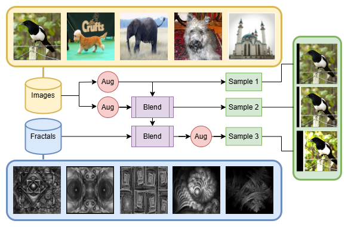
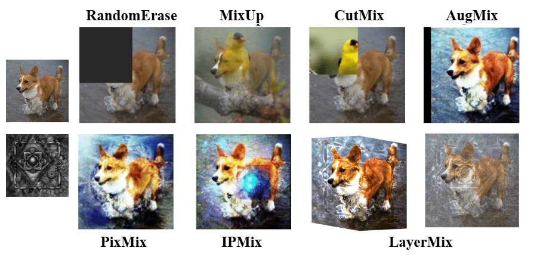

# LayerMix: Enhanced Data Augmentation for Robust Deep Learning

[](https://arxiv.org/abs/2501.04861)
[](https://badges.toozhao.com/stats/01JMJ8ESTHPSMHX10WCEB3ZBK0 "Get your own page views count badge on badges.toozhao.com")
---

---

---
## Latest Updates
- **2025-01-08**: LayerMix paper is released on [ArXiv ](https://arxiv.org/abs/2501.04861).

## Getting Started
Setup anaconda environment using `environment.yml` file.

```
conda env create --name layermix --file=environment.yml
conda activate layermix
```

---
## Usage

`data.py` includes reference implementation of LayerMix, PixMix, and IPMix (+few other too) data augmentations for PyTorch. The `layermix` function is defined as follows:
```python
def layermix(img: Tensor, mixing_pic: Tensor) -> Tensor:
    step = random.randint(3)
    img_copy = img.clone()
    aug_fn = random.choice(aug_fns)
    img = aug_fn(img, magnitude)
    if step == 0: return img
    
    img_2 = aug_fn(img_copy, magnitude)
    blending = random.choice(blending_fns)
    img = torch.clip(blending(img, img_2, blending_ratio), 0, 1)
    if step == 1: return img
    
    blending = random.choice(blending_fns)
    img = torch.clip(blending(img, mixing_pic, blending_ratio), 0, 1)
    return aug_fn(img, magnitude)
```

We also include PyTorch implementations of LayerMix on both CIFAR-10/100 and
ImageNet in `cifar.py` and `imagenet.py` respectively, which both support
training and evaluation on CIFAR-10/100-C and ImageNet-C/R.

Training recipes used in our paper:

### CIFAR: 
  ```
  python cifar.py \
    --dataset <cifar10 or cifar100> \
    --data-path <path/to/cifar and cifar-c> \
    --mixing-set <path/to/mixing_set> \
  ```

### ImageNet:
  ```
  python imagenet.py \
    --data-standard <path/to/imagenet_train> \
    --data-val <path/to/imagenet_val> \
    --imagenet-r-dir <path/to/imagenet_r> \
    --imagenet-c-dir <path/to/imagenet_c> \
    --mixing-set <path/to/mixing_set> \
    --num-classes 200 \
  ```

## Mixing Set
The mixing set of fractals and feature visualizations used in the paper can be downloaded
[here](https://drive.google.com/file/d/1qC2gIUx9ARU7zhgI4IwGD3YcFhm8J4cA/view?usp=sharing). 
Collected and made available by [PixMix](https://github.com/andyzoujm/pixmix/).

## Pretrained Models
Weights for a `WRN-40-4` CIFAR-10/100 classifier for 100 epochs will be available soon.
Weights for a `ResNet-50` ImageNet classifier trained for 90 epochs will be available soon.

## Data availability
| Dataset               | Link |
|-----------------------|------|
| CIFAR-10/100          | http://www.cs.toronto.edu/~kriz/cifar.html|
| CIFAR-10/100-C        | https://github.com/hendrycks/robustness|
| CIFAR-10-C-bar        | https://github.com/facebookresearch/augmentation-corruption|
| CIFAR-100-C-bar       | https://github.com/ahmadmughees/layermix|
| CIFAR-10/100-P        | https://github.com/hendrycks/robustness|
| **ImageNet Datasets** |
| ImageNet-1K           | https://www.image-net.org|
| ImageNet-C            | https://github.com/hendrycks/robustness|
| ImageNet-C-bar        | https://github.com/facebookresearch/augmentation-corruption|
| ImageNet-P            | https://github.com/hendrycks/robustness|
| ImageNet-R            | https://github.com/hendrycks/imagenet-r|
| ImageNet-200          | ImageNet-1K subset with the same classes as ImageNet-R ([List of classes](https://github.com/ahmadmughees/layermix)) |


## Citation
If you find this useful in your research, please consider citing:
```bibtex
@article{ahmad2025layermix,
      title={LayerMix: Enhanced Data Augmentation through Fractal Integration for Robust Deep Learning}, 
      author={Hafiz Mughees Ahmad and Dario Morle and Afshin Rahimi},
      year={2025},
      eprint={2501.04861},
      archivePrefix={arXiv},
      primaryClass={cs.CV},
      url={https://arxiv.org/abs/2501.04861}, 
}
```
## ❤️ Acknowledgment
We would like to thank the following codebases for their amazing work.  

* https://github.com/google-research/augmix
* https://github.com/andyzoujm/pixmix/
* https://github.com/hzlsaber/IPMix/
* https://github.com/huggingface/pytorch-image-models/blob/main/timm/data/auto_augment.py
* https://pytorch.org/vision/stable/_modules/torchvision/transforms/autoaugment.html#AugMix
